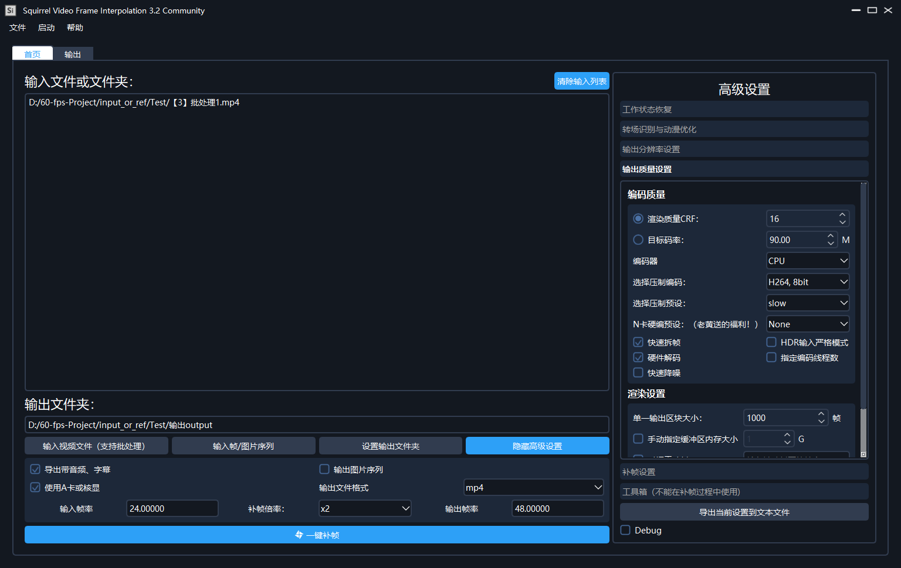

# Squirrel-RIFE Video Frame Interpolation
 - BY Squirrel Development Team
 - 基于RIFE算法的中文补帧软件

----

## ✨ 特点

- 效果更好，显存占用极小，是DAIN速度的二十倍

- 包含抽帧处理，可去除动漫卡顿感

## 🖥 系统要求
- Windows 7 及以上操作系统

- NVIDIA 显卡以及 GeForce Experience 所安装的驱动

- Microsoft Visual C++ 2015-2019 Redistributable

- 至少 2GB 以上显存以及 4GB 左右的空余内存

## 🌎 补帧效果演示 BiliBili

[【120FPS】EVA × KATE × 米山舞「绫波丽，首次口红，在那之后」](https://www.bilibili.com/video/BV1yz4y1m7iF)

[【100 FPS】【泠鸢】大喜【SVFI 更先进的补帧技术】](https://www.bilibili.com/video/BV1up4y1h7Jr)

[【4K120fps】TV动画《魔女之旅》NCOP リテラチュア](https://www.bilibili.com/video/BV1sr4y1P7Wg?from=search&seid=17356442119935352422)

[【60FPS】Final Phase](https://www.bilibili.com/video/BV1gK4y1Q7d9?from=search&seid=9891874569533059429)

[【SVFI插帧演示】（《崩坏3》动画短片「渡尘」）](https://www.bilibili.com/video/BV1fX4y1P7s3)

[【命运石之门OP】](https://www.bilibili.com/video/BV1zo4y197SA?from=search&seid=9891874569533059429)

## 📜 使用教程（一定要看！！）

### Squirrel-RIFE:

https://www.bilibili.com/video/BV1uo4y1d7Cr/ 

## 📦️ 软件界面

## 📦️ 下载地址

### Squirrel-RIFE:

Github: [2.3.beta](https://github.com/YiWeiHuang-stack/Squirrel-RIFE/releases/tag/v2.3.beta)

## ☑️ 问题反馈

点击加入群聊[【SVFI交流群】](https://jq.qq.com/?_wv=1027&k=BKQQ75b9)

## 参考

- [arXiv2020-RIFE](https://github.com/hzwer/arXiv2020-RIFE)
- [ncnn](https://github.com/Tencent/ncnn)
- [ncnn-rife](https://github.com/nihui/rife-ncnn-vulkan)
- [python-ncnn-rife](https://github.com/ArchieMeng/rife-ncnn-vulkan-python)
- [RIFEInterpolation](https://github.com/YiWeiHuang-stack/RIFEInterpolation)  
- [RIFE_GUI](https://github.com/Justin62628/RIFE_GUI)
