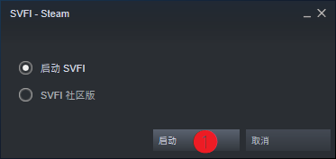
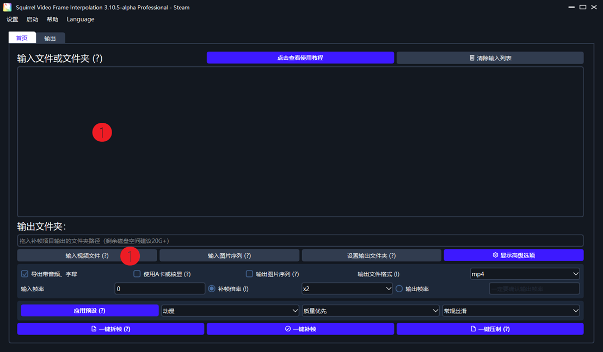
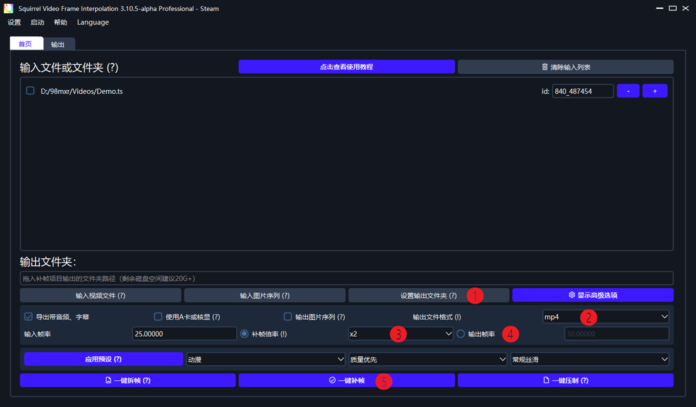

# SVFI 上手指南 V1.0

​		欢迎使用Squirrel Video Frame Interpolation补帧软件。此软件致力于将卡顿的低帧率视频升格为流畅的高帧率视频。**以下是使用SVFI对一个视频进行补帧的基本教程。**无论您之前是否有过任何类似的补帧经验，请您相信，如果遵照以下流程，您将会获得一段愉快的补帧体验。

1. 确认自己的显卡符合本软件的最低要求：GTX 750Ti及以上，Maxwell架构以上的显卡。如不符合此要求，请及时退款止损，并换用其他补帧软件。
2. 在Steam的内容库页面找到SVFI

3. 启动SVFI

 

 

4. 等待软件启动，您将会看到以下的空白操作页面。这是SVFI的**主界面**。请注意，此教程针对SVFI 3.x全系列版本，您看到的软件版本号也许与截图不同。
   - 要对一个**视频**进行补帧，您首先需要选择下面的选项❶“输入视频文件”，在弹出的文件选择窗口选择要补帧的视频。
   - 您也可以将视频直接“拖”入窗口❶中。

 

5. 输入一个视频后，我们需要进行一些基础设置。

   - 第一件事：从选项❶“设置输出文件夹”选择补完帧的视频的位置，即**输出文件夹**。如果不指定，补完帧的输出视频会在**输入视频所在文件夹**。

   - 设置选项❷“输出文件格式”以确定补完帧的视频格式为.mp4、 .mkv或.mov，mp4文件通用性较好，mkv支持更多种类的音频，mov使用的场景很少。**请尽可能与输入视频保持一致，若输入视频的格式不在上述三者中，使用mp4。**

   - 您会发现选项❸左边已经显示了输入视频的帧率。您可以直接在选项❸“补帧倍率”中选择补帧的帧率倍数，或者在❹“输出帧率”中手动填写帧率。**填多少都可以，60、120都行**，SVFI会帮你处理一切。

6. 恭喜您已经完成了所有必要设置，现在点击❺**一键补帧**，就可以去泡杯咖啡，在输出文件夹等待输出结果。 
   - 如果软件不幸发生错误，或者你没在输出文件夹看到自己心心念念的输出视频，请移步《SVFI常见错误处理办法》获取可能的解决方案；
   - 如果《办法》内未列出相应问题的解决方案，请在Steam讨论区发帖以联系开发人员帮助解决，我们会在48h内回复。