# SVFI使用说明书 V2.1

## 软件介绍

- 欢迎使用**Squirrel Video Frame Interpolation**补帧软件。
- 此软件是基于 [RIFE](https://github.com/hzwer/arXiv2020-RIFE) 等多种算法的AI补帧软件。
- 此软件支持中文和英文，由**Squirrel Development Team**出品。

## 一、 SVFI使用基本教程 

### 1. 设备以及环境需求

- 本软件支持NVIDIA GPU、AMD GPU补帧。**但只建议使用NVIDIA GPU补帧。**
- 在开始使用本软件之前，确认自己的软件环境和硬件设备符合本软件的最低要求：
  - 计算机具备有Windows 10 64位或以上的操作系统
  - 内存大于等于8GB
  - 存储空间大于20GB（软件本体约5GB）。
  - *若为NVIDIA GPU，必须高于 **GTX 750Ti，Maxwell架构**以上*
  - **如果不符合要求，请及时退款止损，并换用其他补帧软件。**

### 2. 软件使用注意事项 

- 请您注意输出视频文件格式尽量与视频输入文件格式一致
  
   **示例如下**

  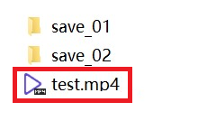
  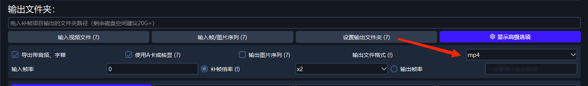

  **如果没有对应格式，建议您选择mkv格式**

- 输出文件夹尽可能设置在剩余空间较大的盘符，系统盘剩余空间大小不要小于1G 

- 任务启动前检查“导出是否带音频”(选上即可无损保留原视频的音频字幕轨，章节自动复制) 

  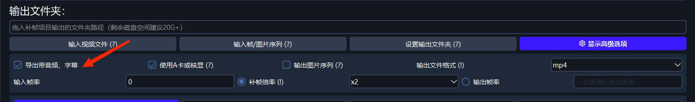

- ***鼠标悬浮在带（？）或（！）的选项上方会弹出使用说明浮窗。推荐在调整软件默认设置前认真阅读此类选项说明，将为您节省不少的时间！*** 

  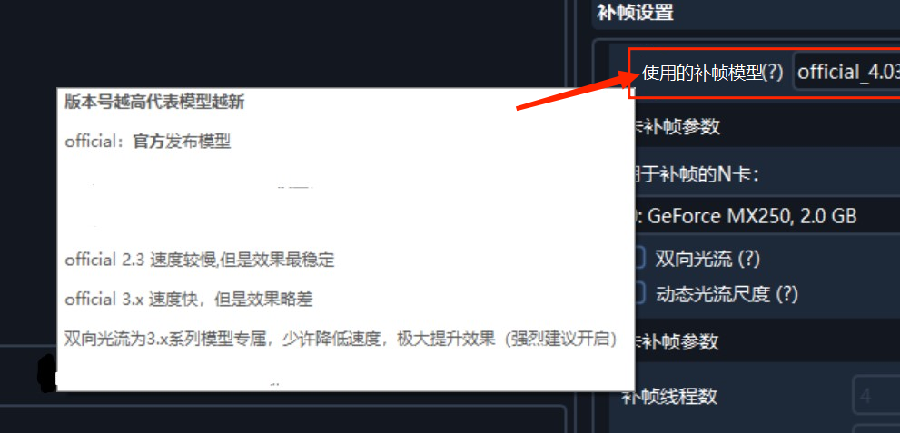

## 二、 快速补帧教程

请阅读**《SVFI上手指南》**

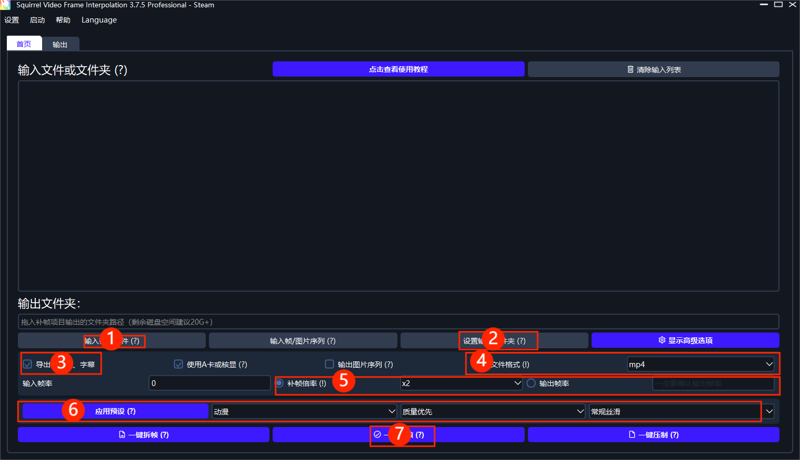

## 三、 高级设置

高级设置共有七大栏目

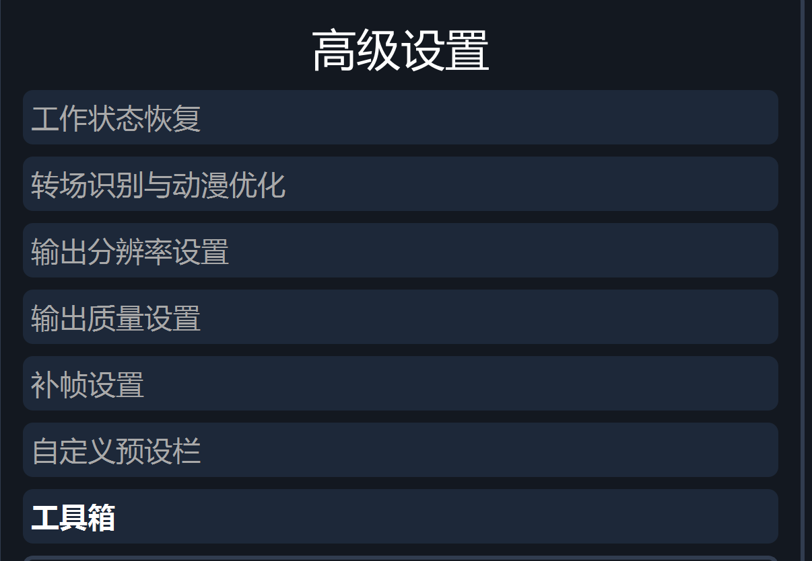

### 1. 工作状态恢复 

- **自动寻找进度**—— 当您遇到任务中途断电或者其他以外情况终止任务导致程序退出的情况，可以通过点击 “**自动寻找进度**”来恢复上次的区块位置。
  
    > ***谨记！***点击此按钮前请您先点击要恢复进度的任务条目。随后点击“**一键补帧**”，软件将弹窗向您确认补帧起始位置。

  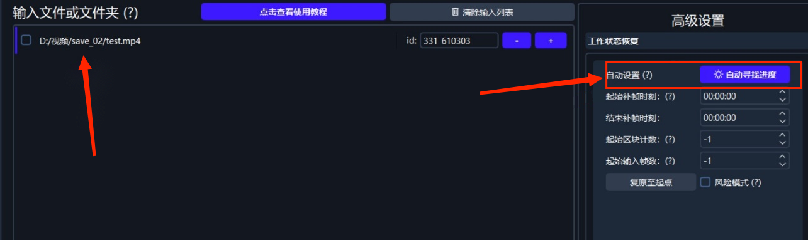

- **【专业版】起始补帧时刻和结束补帧时刻**——可以手动选择需要补帧的时间段，**请注意此功能不支持任务进度恢复**

  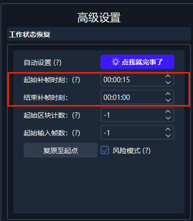

> **输入格式:    小时:分钟:秒**

- **起始区块计数和起始输入帧数**——可用于手动恢复补帧进度
  - **起始区块计数 **= 输出文件夹中导出的**最后一个$chunk$数 + 1**（例如图中的**$chunk-001$**，应将起始区块计数为**1+1=2**）
  - **起始输入帧数** = 输出质量设置（渲染设置）中**单一输出区块大小** \* (**起始区块计数 - 1**)

  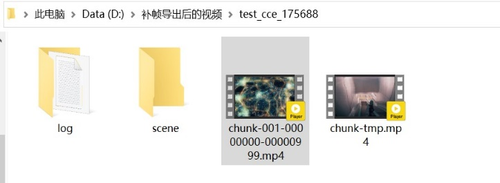
  
  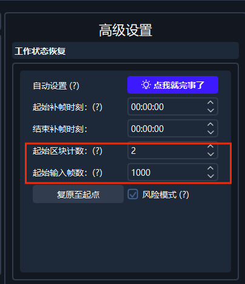
  
  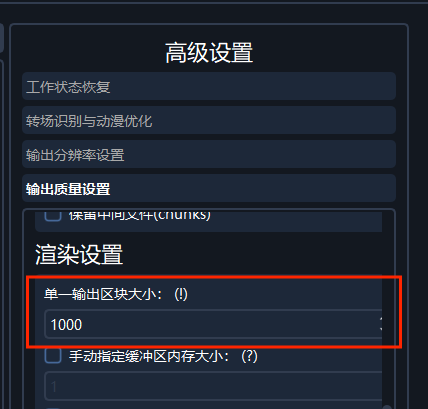

  ***如上图，一个视频chunk有1000帧***

-   **复原至原点**——可将起始区块和起始输入帧数归为原值，**从零开始补帧。**

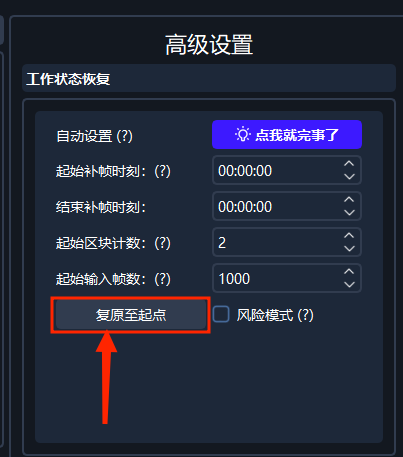

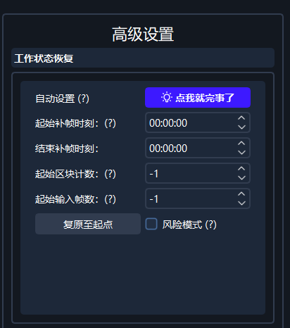

-   **风险模式**——当需要恢复任务进度时，开启此项可以**减少程序恢复进度所需的时间**，但开启可能会造成**音画不同步**，**不推荐开启**。

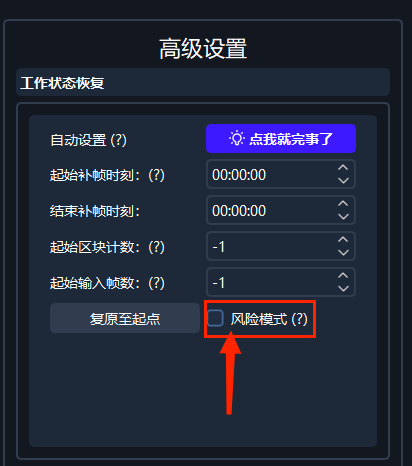

### 2.1 转场识别

-   **开启转场识别**——识别场景切换
    -   为了在补帧过程避免场景切换时产生**果冻**效应，建议您开启转场识别。
    -   在勾选了开启转场识别之后，下方的参数值一般选择12。
    -   如果在补帧过程中您发现转场错判较多，可以考虑调节至15；面对转场漏判较多的情况时可以考虑将参数值调到9，参数值的范围一般为9-15。

  ***如图：转场漏判产生果冻***

  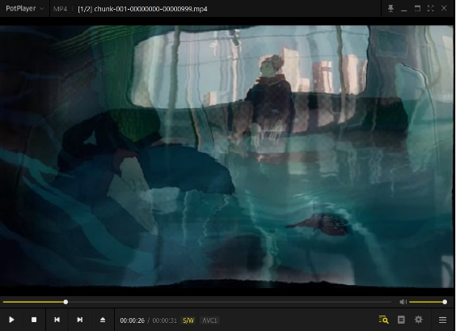
  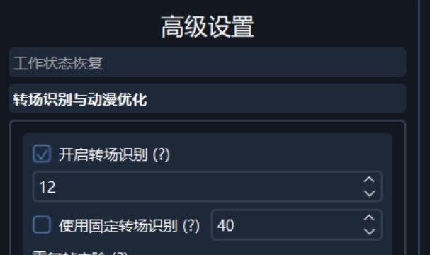

-  使用固定转场识别(使用固定的阈值判断每一帧之间的区别以识别转场)
   -  **不建议您开启这项功能**
   -  使用这项功能时，需要同时开启“开启转场识别”功能。
   -  如果补帧视频是实景拍摄视频，参数值建议设置为40，如果补帧视频为动漫，参数值建议设置为50或60。 

### 2.2 去除重复帧(动漫流畅度优化) 

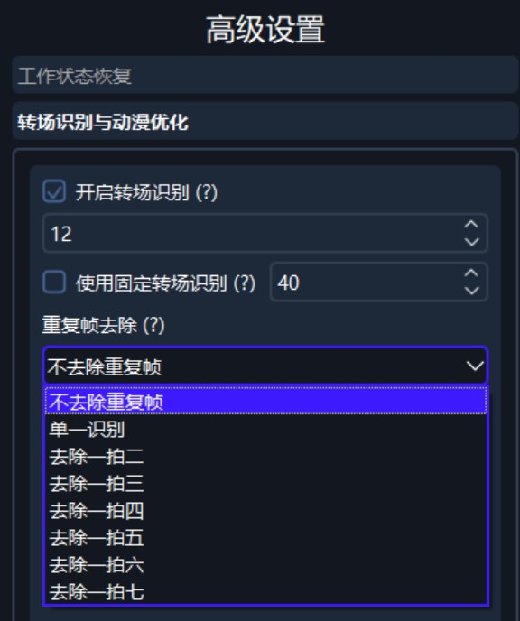

- **不需要去除重复帧**——不使用该项功能 

- **单一识别**——（在处理动漫补帧时可能会使用到此功能）用于**缓解*1拍N***情况对画面造成的**卡顿感**，参数设置一般为 0.8。如果参数值设定过高，**导致软件补帧难度过大超出AI补帧的能力范围**，会产生**扭曲严重**的情况。如果补时间较长的动漫，参数值建议设定为0.1或者0.01***（否则会出现人物“嘴巴合不上”的画面问题）***。

  ***(该除重结果最暴力，无法自动识别动漫作图模式)***

- **去除1拍2**：该功能是专为动漫抽帧设计的功能，请您根据自己的需要来选择开启或关闭（选择性开启）。 

> **注:*由于现阶段AI补帧在动漫补帧方面能力有限，选择去重将加大帧间运动幅度，导致补帧时产生画面扭曲，请自行对于每个输入视频控制变量多次试验选择最好的除重模式。***

> ***建议您谨慎选择去重模式，对于一般的补帧操作开启去1拍2功能就能满足需求***

- **转场使用帧混合：**在软件补帧的过程中场景切换时，原本采用**帧复制**完成；勾选此选项后，使用**帧混合**来代替原本的帧复制。

- **输出转场帧**：此功能可以将识别到的转场帧和转场帧的前一帧输出保存在导出文件夹中。

 

### 3. 输出分辨率设置 

- **输出文件分辨率：**

  在进行补帧之前您需要根据**预设**以及自己的要求，先对**画面的分辨率进行调整**，之后再进行AI补帧操作。

- **调节黑边长度：**

  ***本软件可以裁剪调节视频中的黑边，在使用之前需要根据示例图片手动设置宽高。*** 

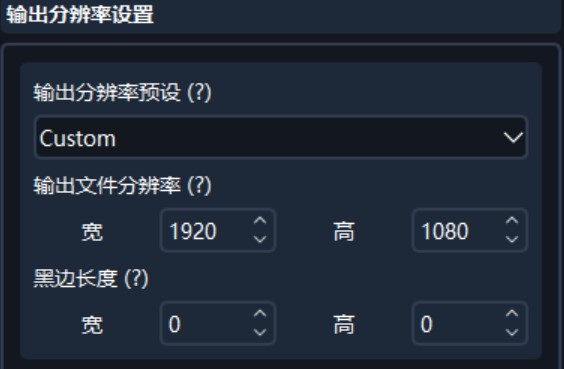
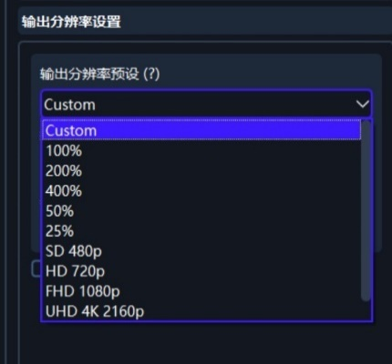

- **使用AI超分：**

  这个功能是此软件的核心部分可以使视频画面更加清晰，目前支持***waifuCuda(自训练) ，waifu2x，realESR***等超分算法。**通过使用此功能，您操作的视频会更加清晰，让您有更好的观看体验。**

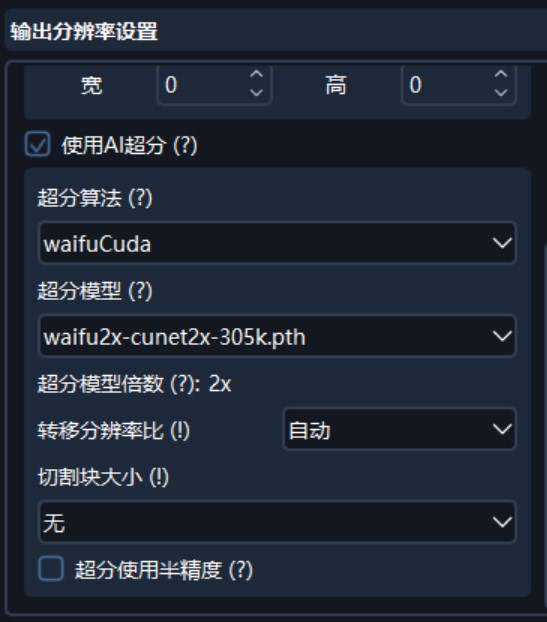

***waifu2x（此算法相比于waitfuCuda算法更适合于2D动漫输入，且速度较快。）***

***waifuCuda （此算法适合2D动漫输入，作用效果好。但是此算法的处理速度比waifu2x慢。)***

***realESRGAN (在本软件提供的范围中，此算法处理速度非常慢，效果较好。)*** 

- **对于超分模型的介绍:**
  
  - **waifuCuda:**
    - **此超分模型适用于动漫输入**。
  
  - **realESR:**
    - **GAN**模型画面更加清晰，艳丽。
    - **Net**模型偏向画面的涂抹，操作后画面保持原色彩 。
    - **anime**模型适用于动漫超分设计方面，处理的速度较前两者略快  。
    - **anime**为官方模型，**anime_110k**为自训练模型。
    - **RFDN** 为自训练超分模型，**处理速度快**，在使用时适合于动漫输入。
  
  -  **waifu2x:**
    - cunet模型使用时适用于动漫超分方面。 
    - photo模型补帧过程中适用于实拍。
    - style anime模型补帧适用于老动漫的超分操作。
  
- **模型放大倍数:**

  此处表明超分模型**单次计算能将原分辨率放大的倍数**。

- **转移分辨率比**:

  此功能会先按照用户设置的百分比缩放原视频，之后再进行超分操作。

  - ***例:原视频1920x1080，转移分辨率比50%， 模型放大倍数4x***

    运行过程: ***1920x1080 -> 960x540(下采样) -> 3840x2160(超分辨率)***

- **切割块大小:**

  - 对于**CUDA系超分模型**（WaifuCuda，RealESR），由于消耗显存较多，在输入前会对输入画面进行切割后超分，随后再拼接。
  - 不同切割大小会让超分算法有不同的表现，如切割大小较小时输出画面原本应该虚化的远景会更加锐利而显得不太自然。
  - 请仔细阅读选项说明，**将鼠标悬浮在(!)上阅读说明**
  - 此功能带有显存大小制定的预设，用户也可以自定义调节。

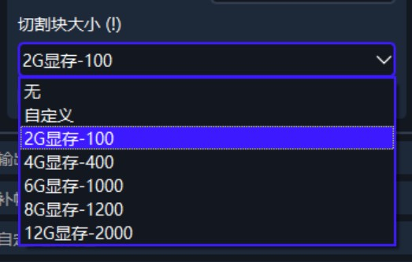

- **超分使用半精度:**

  此功能推荐开启，开启后操作过程中可大幅度减小显存占用，对画面质量影响较小，但可能减慢超分速度。

### 4.1 输出质量设置（压制参数质量） 

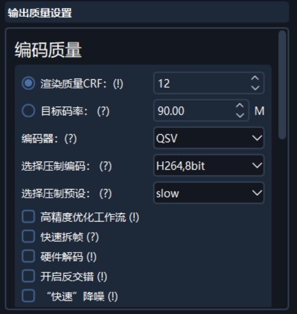

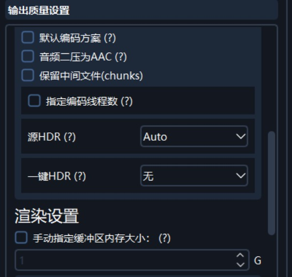

- **渲染质量CRF**

  此功能用于调整视频导出时的画面质量亏损， 与**输出码率呈正相关**。使用不同压制编码和压制预设均会对CRF产生影响。

  - **CRF数值参数一般为16**，此时肉眼无损；对于H.265编码，码率会有明显下降。**请以肉眼所见画面质量来评定CRF数值大小是否合理。**
  - 如果是作为**收藏CRF数值参数可设为12**。**CRF的数值越小，操作过程之后对画面损失就越小，同时导出的成品视频体积（码率）越大。**

  ***注意：相同数值，不同编码器的输出质量不同***

- **目标码率**

  作为替代渲染质量CRF的可选项，和Adobe Premiere Pro，达芬奇的设置标准基本相同 

- **编码器** 

  - **CPU**
    - 选择此项压制，**质量最高，但CPU占用率也最高**。**CPU的性能优劣**决定补帧过程中是否会阻塞补帧（导致显卡占用下降），以及最后操作完成的**时间长短**。 
  - **NVENC**
    - 此项仅**供支持NVENC功能的NVIDIA显卡**选用，如果您的显卡并**不支持NVENC功能请不要选择此项**。 
    - 请自行查阅安装目录下的NVIDIA NVENC Gen.pdf查阅自己的显卡是否支持NVENC
  - **QSV**
    - 此项仅支持有**Intel核显**的用户选用***(例如Intel UHD 630)***，非此类用户不要选用。 
  - **NVENCC**
    - **NVENCC**为**NVENC**的优化版本，处理速度更快，作品质量更好。
  - **QSVENCC**
    - **QSVENCC**为**QSV**的优化版本，完成任务的效率更高。

- **选择压制编码**

  对于此项功能的选择，需要您具备一定的**视频压制常识**。

  - **如果您缺少压缩方面的知识，请您谨记以下规则：**
    - HDR输出务必选择**H.265 10bit**编码
    - 2K以上分辨率务必选择 **H.265** 编码（尤其是4K，8K分辨率）
    - 如果H.264、H.265编码均出现问题，使用**ProRes**编码。此编码输出最贴近肉眼无损，码率极大，是用于剪辑工作的中间编码格式。
    - 推荐使用H.265 fast编码或ProRes编码

- **选择压制预设**

  此栏目下对应的项目，英文含义**速度越快的作品质量越低，反之质量越高**。

- **【专业版】高精度优化工作流**

  若CPU性能过剩，建议您开启此项功能，可**解决多数画面颜色偏差问题**，并可最大程度解决HDR视频压制产生的色偏问题。此功能会**加大CPU负担**，甚至影响补帧速度。请您**酌情选择**。

- **快速拆帧**

  快速拆帧操作可以**减轻解码压力**，但可能会**导致画面色偏问题**。

- **硬件解码**

  可以**减轻CPU解码压力**，但可能会在一定程度上**降低画面质量**，并在显存紧张时导致补帧模块**爆显存**。

- **开启反交错**

  使用**ffmpeg**对输入的**交错视频**进行反交错处理**。**

- **快速降噪**

  此栏目下的“快速”选项如果不是特殊需要，请保持关闭，否则会**减缓任务处理速度**。

  - 推荐自行控制变量试验此选项是否对画面质量提升有帮助。
  - 与高精度优化工作流不兼容

- **默认编码方案**

  此功能可以提高压制兼容性，但是压缩率和质量可能会下降。

  - **启用此功能可以解决大多数broken pipe问题。**

- **音频二压为AAC**

  将视频中的所有音频轨道压制为**640kbps的aac格式**。

- **保留中间文件(chunks)**

  补帧完成后**不删除中间生成的chunk视频**。

- **指定编码线程数**

  当您的编码器选择为CPU时，可以**稍微提高CPU占用率以加快渲染速度**。 

- **源HDR(需要原视频支持)** 

  - **Auto**
    - 自动识别(检测到HDR内容会自动切换到CPU压制)。 
  - **Custom HDR**
    - 自定义HDR （不会写入HDR源数据）。
  - **HDR10**
    - 基本， 普及的HDR格式。
  - **HDR10+ **
    - HDR10+（仅支持按补帧倍率补帧，不能自定义输出帧率）。
  - **Dolby Vision**
    - 杜比视界 （仅支持按补帧倍率补帧，不能自定义输出帧率）。
  - **HLG**
    - 索尼新科技（便携HDR工作流程）。

- **一键HDR**

  将SDR转换为HDR10+。

### 4.2 其余渲染设置 

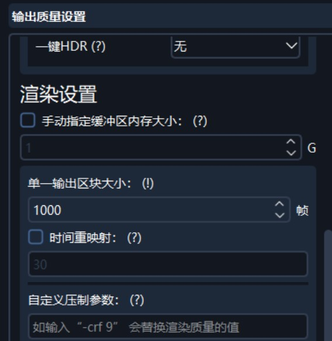

- **手动指定缓冲区内存大小**

  若运行内存紧张（16G以下），建议**手动指定缓冲区内存的大小**为2~3G避免**爆内存**错误。

- **单一输出区块大小**

  对于补帧和压制任务，每渲染数量为该值的帧，将输出一个不带音频的小片段，以方便您**预览效果**。片段会生成在您设置的输出文件夹中，**并在补帧或压制任务完成后合并为一个文件**。

- **时间重映射**

  此功能用于制作“慢动作”素材。例如设置输出帧率为120帧，时间重映射设置为60帧，输出效果等同于50%**播放速度慢放**。其他情况依次类推，您可以自己设置输出帧率，**参数值支持小数**。

  ***（动漫素材请尽可能用PR等软件降低原视频的帧率来完成重复帧的去除，以避免重映射后卡顿。原视频帧率一般降低到8或12帧）***

- **自定义ffmpeg压制参数**

  此功能为专业选项（注意输入项数必须为**偶数**）。 

### 5. 补帧设置 

- **N卡模式**
  
  - **半精度模式**
    - **若显存紧张**，可以尝试开启此功能。
    - 此功能可能导致**视频花屏、画面抖动等问题**，如果任务过程中预览chunk发现这些问题，则不建议开启。
    - 与3+模型不兼容
    
  - **反向光流**
  
    - 该功能可使画面在一定程度上**更加丝滑**。 
  
  - **光流尺度**
  
    - 对于纹理较多的视频建议选择1.0。
    - 运动速度较大的视频可以调节至0.25，0.5等。
    - **提高光流尺度可以减少果冻和消失的问题。** 
  
  - **TTA模式**
  
    - 开启该功能可以**减少画面果冻，减小字幕抖动，减弱物体消失的问题**。使得画面更加**平滑舒适**
    - **需要额外消耗补帧时间，同时部分补帧模型不支持此功能**。 
  
  - **交错补帧**
  
    - 此功能可**解决补帧显存崩溃的问题**，**减小补帧占用**，同时可能会**降低画面质量**。
    - 恰当选择此项可以让小显存显卡补超大分辨率（如4G补8K）
  
  - **使用的补帧模型 :**
  
    - **anime_sharp**
  
      - 自训练补帧模型，部分场景消失问题可能减少，同时顺滑度有优化。
    - **official_2.3**
  
      - RIFE官方公开的2.3模型，通用模型，效果稳定。**是当前普适性最强的模型。**
    - **official_3.6**
      - RIFE官方公开的3.6模型，为动漫设计的模型，速度更快。
    - **official_3.8**
      - RIFE官方公开的3.8模型，为动漫设计的模型，速度更快 
    - **official_4.0**
      - RIFE官方公开的4.0模型，支持任意时刻插帧(对指定帧率输出的优化更好)
      - 速度极快是其主要优点，最高可达2.3的六倍以上速度。
    - **official_4.0+**
      - 4.0模型强化版(在大幅度运动的画面上效果可能会更好)。
  
  - **用于补帧的N卡**
  
    - 如果您的设备上有多张显卡，需要指定用哪张N卡补帧。 
  
  - **双向光流**
    - 对于official_3.x系列的模型能够起到**大幅度提升补帧质量的作用（减少硬字幕抖动等）**，但是会降低速度 ，但**与official_4.x系列模型不兼容**。
  
  - **动态光流尺度**
  
    - 在补帧过程中动态选择光流尺度，可**减少物体消失问题**，但可能会引入**画面抖动**。
  
      
  
- **A卡独显和核显模式**
  
  - **光流尺度**
    - 此功能的参数设置只有0.5和1.0，**详细信息请参考N卡中的相同功能解释**。 
  
  - **用于补帧的模型** 
    - **rife-v2**
    
      稳定2.x系列模型。 
    
    - **rife-v3**
    
      实验性3.x系列模型**。** 
  
  - **补帧线程数**
  
    理论上线程数越多，速度越快，效率越高，同时**增加显卡压力**。
  
  - **选择的GPU**
  
    0代表设备0，1代表设备1。 
    
    

***（输出文件名将带有反应上述设置的缩写）*** 

在**标题栏**的**快速教程**中可以看到具体信息

### 6. 【专业版】自定义预设栏 

-   **基于当前设置新建预设**
    - 命名当前的预设之后创建就可以新建预设。
    
-   **移除当前预设**
    - 删除当前选中的预设。
    
-   **应用指定预设**
    - 加载之前保存的预设，自动载入参数。
    

### 7. 工具箱 

-   **视频转换 GIF 动图**
    - 生成高质量的 GIF 动图。 
-   **循环动图**
    - 默认打开
-   **拆帧选中输入到输出文件夹**
    -   将选择的文件拆成图片序列

-   **对输入使用输出质量设置内的指定参数压制**
    -   压制视频 

- **音视频合并**

***移动鼠标到各选项上方可以看到具体说明***

### 8. 标题栏 

- **设置**
  - 偏好设置  

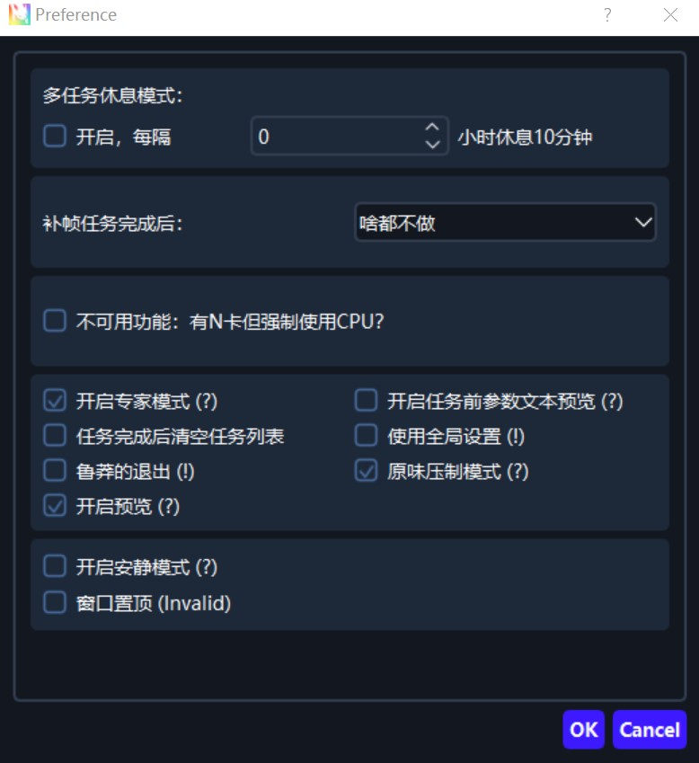

- **多任务休息间隔**
  - 每隔 X 小时让显卡休眠若干分钟以避免显卡过热 

- **补帧任务完成后**
  - 可以选择一些补帧完成后的自动操作  

- **不可用功能**
  - 强制使用 CPU 进行补帧（已弃用）  

- **开启专家模式**
  - 默认开启  

- **开启任务前参数文本预览**
  - 点启动补帧之前会先弹出弹框，可以浏览一遍确定参数设置正确后进行补帧  

- **任务完成后清空任务列表**
  - 列表中所有任务完成后清理队列  

- **使用全局设置**
  - 对所有任务进行统一参数设置  

- **强制退出**
  - 强制结束软件进程(若关闭软件后发现显存仍在占用，则建议开启此项)

- **原味压制模式**
  - 单独对任务进行压制时，不开启重复帧去重的操作。

- **开启预览**
  - 补帧时开启预览窗口

- **开启安静模式**
  - 软件启动时不启动黑色窗口  
- **窗口置顶（目前不可用）**
  - 将窗口置于顶层 

## 四、 常见问题与解决方案

### 1. 软件提示显存不足或内存不足如何解决

-  显存不足：

  - 补帧**1080P视频**至少需要**2G显存**，**4K视频**至少需要**6G显存**。请尝试启用交错补帧以避免超出显存限制。

  - 如果您确定您机器的显存足够大，可以尝试**重启机器观察是否解决问题**。

  - 在输出分辨率设置中，降低视频分辨率可以尝试在输出质量设置中，开启半精度模式。也可以在补帧设置中尝试调低光流尺度(设置为**2.0及以上**会极大增加显存占用，请务必检查此选项的值)。 

- 内存不足：

  - 对于运行内存16G以下的机子，推荐使用**输出质量设置**内的**手动指定缓存区内存大小**功能来指定内存使用大小。推荐的最小值：2G。

### 2. 补帧中途退出了是否可以恢复进度？ 找不到进度？

- 到工作状态恢复中点点击“**自动寻找进度**”。 
- 若点击该按钮后软件显示“未找到工作进度”，请您按以下步骤排查问题：
  - 确认输出文件夹存在
  - 确认输出文件夹内有命名形如chunk-xxx-yyyyyy-zzzzzz的视频文件，若不存在，则说明无可恢复的工作进度
  - 确认输出文件夹的**后10位**与输入文件的**任务id**相同，若不相同，请手动更改任务id再点击按钮重试。
  - 如还是无法解决问题，请将鼠标移至选项按钮上方，仔细阅读选项说明，按提示在**起始区块计数和起始输入帧数**填写合适的值。

### 3. 补帧效果不丝滑怎么办 

- 这种情况可能是原视频中带有重复帧，或者动漫(带1拍N)，可以尝试到**转场识别和动漫优化选项卡**中开启重复帧去除，并调整去重数值。 

### 4. 导出视频的画面噪声大怎么办

- 补帧前到编码质量设置中**拉低渲染质量CRF数值**，或者**调整压制预设**。 

### 5. 显卡占用率低怎么办 

- 首先在任务管理器中，点一下3D占用率旁边的小三角，换成**CUDA**。
- **CUDA占用率一般在85% 左右或者更高为正常。**
- 如果占用还是低，请检查CPU利用率是否达到100%；若达到100%，说明软件遭遇CPU瓶颈。这种情况可以调节其他选项，直到显卡占用率达到80%以上。 

### 6. 补帧出来的视频画面有扭曲等怎么办 

- 如果这种情况出现在动漫补帧中，**建议关闭去除重复帧，或者调小去重数值，也可以尝试提高光流尺度以减少画面果冻出现的可能性。**
- 如果您具备视频剪辑相关技能，可以耐心使用不同参数多补帧出几个视频，并将每个片段取优秀结果进行拼接。
- 如果是内嵌字幕（硬字幕、烧录字幕）扭曲，目前并没有较好的解决方法。如果动漫补帧，推荐使用无字幕的资源进行补帧，之后找字幕进行嵌入。

### 7. 长时间补帧是否会伤害显卡 

- 长时间跑CUDA一般不会对显卡造成寿命影响，但如果散热措施没有做好，温度过高，或者超频后跑补帧程序还是会对显卡产生损伤。
- 根据EULA（软件使用用户协议），SVFI不对补帧造成的硬件损坏负责。

### 8. 显存吃不满怎么办 

- 显存不一定是占用的越多速度就越快，运行SVFI程序即使把显存占用满也不一定能得到速度提升，因为有渲染队列长度限制，机器功耗限制等其他大量限制因素。

### 9.Broken Pipe怎么办 

- 可以尝试去输出质量设置中降低N卡硬编预设所选择的参数，或者关闭这一项功能。
- 使用CPU H.265 Fast或者ProRes编码

  

## 五、推荐任务预设

对于**压制模式**，2K以上分辨率**务必**使用H265或ProRes编码

### 1. 社区版 

#### 1.1 动漫 

| 场景            | 转场 | 去重模式              | 压制模式          | 光流设置  | 补帧模型 |
| --------------- | ---- | --------------------- | ----------------- | --------- | -------- |
| 质量            | 12   | 单一识别 0.8          | CPU H.265 medium  | 光流 0.5  | 模型 2.3 |
| 常规            | 12   | 单一识别 0.8 / 一拍二 | CPU H.265  fast   | 光流 0.5  | 模型 2.3 |
| 速度（N卡）     | 12   | 单一识别 0.8          | NVENC  H.264 slow | 光流 0.5  | 模型 4.x |
| 极致速度（N卡） | 12   | 单一识别 0.8          | NVENC  H.264 slow | 光流 0.25 | 模型 4.x |

#### 1.2 真人 

| 场景     | 转场 | 去重模式 | 压制模式         | 光流设置 | 补帧模型 |
| -------- | ---- | -------- | ---------------- | -------- | -------- |
| 质量     | 12   | 关闭去重 | CPU H.265 medium | 光流 1.0 | 模型 2.3 |
| 常规     | 12   | 关闭去重 | CPU H.265 fast   | 光流 0.5 | 模型 2.3 |
| 速度     | 12   | 关闭去重 | NVENC H.264 slow | 光流 1.0 | 模型 3.6 |
| 极致速度 | 12   | 关闭去重 | NVENC H.264 slow | 光流 0.5 | 模型 3.6 |

 

   

### 2. 专业版 

#### 2.1 动漫 

（务必确认自己的播放器可以播放 H.265 10bit，否则选择 H.264 veryslow） 

| 场景     | 转场 | 去重模式     | 压制模式                  | 光流设置  | 补帧模型           |
| -------- | ---- | ------------ | ------------------------- | --------- | ------------------ |
| 极致质量 | 12   | 一拍二       | CPU  H.265 10bit veryslow | 光流  0.5 | 模型 2.3 + TTA     |
| 质量     | 12   | 一拍二       | CPU H.264 veryslow        | 光流 0.5  | 模 型 anime  sharp |
| 常规     | 12   | 一拍二       | CPU H.264 slow            | 光流 0.25 | 模 型 anime  sharp |
| 速度     | 12   | 一拍二       | NVENC H.264 slow          | 光流 0.5  | 模型 4.x           |
| 极致速度 | 12   | 单一识别 0.8 | NVENC H.264 slow          | 光流 0.25 | 模型 4.x           |

#### 2.2 真人 

（务必确认自己的播放器可以播放 H.265 10bit，否则使用 H.264 veryslow） 

| 场景     | 转场 | 去重模式 | 压制模式                 | 光流设置 | 补帧模型 |
| -------- | ---- | -------- | ------------------------ | -------- | -------- |
| 极致质量 | 12   | 关闭去重 | CPU H.265 10bit veryslow | 光流 1.0 | 模型 2.3 |
| 质量     | 12   | 关闭去重 | CPU H.264 veryslow       | 光流 1.0 | 模型 2.3 |
| 常规     | 12   | 关闭去重 | CPU H.264 slow           | 光流 0.5 | 模型 2.3 |
| 速度     | 12   | 关闭去重 | NVENC H.264 slow         | 光流 1.0 | 模型 4.x |
| 极致速度 | 12   | 关闭去重 | NVENC H.264 slow         | 光流 0.5 | 模型 4.x |

 

## 六、关于SVFI使用的一些Tips 

1. 在svfi 中，大部分选项不是数字越高效果越好（**如转场参数，去重参数，CRF，光流尺度，补帧模型**）。如果不懂建议严格按照说明**或默认**来选择。
2. **对于每个带有（？）或（！）的选项，鼠标悬浮在其上方会显示相应解释。**
3. 如果**追求质量**，全部**选择常规以上的预设**；**速度**选项相对效果差。
4. 对于CRF如果没有相应的知识，就默认选择参数16或者通过百度学习相关知识。 
5. 鼠标悬浮在**转场选项**上，可以看到**相应说明**。转场选项通常**参数设置在12** 即可。 
6. 去重选项只有2d 动漫需要使用去重选项3d，真人一律选择不去除重复帧。 
7. 社区版：单一识别功能中，根据用户反馈**参数值设置在0.8-1.0效果较好**。 
8. 专业版：功能**1拍2**更保守，软件**错误更少**。功能**1拍3及以上**更激进更丝滑，但是**问题和错误经常更多**（如画面消失等）。 
9. 如果没有特殊情况，建议您选择功能1拍2，其他选项参数全部默认就可以。 
10. 在svfi 补帧时，一般情况下会占用CPU（选用CPU 编码时）和n 卡的cuda。如果CPU一直满载，而cuda 占用波动极大时，则CPU为瓶颈。此时可以**调整压制预设或者更换编码器以加快速度**（如CPU H.265 very slow 调整为fast，CPU H.264 slow 调整为NVENC H.264 slow）。 
11. 注意如果CPU 不为瓶颈，推荐选用**更佳的编码器和预设**。因为显卡的cuda 决定了补帧速度，CPU 决定了编码速度。补帧速度只能通过**更换更好的显卡来提升**，但是**编码速度可以考虑通过选择速度更快**，质量稍逊的编码器和预设。 
12. CPU 编码为软编，软编**普遍速度慢文件小、质量好**。 
13. NVENC 和qsv 为硬编其中NVENC 使用n 卡，qsv 使用intel 核显硬编普遍速度快、文件大，但质量比CPU 差。 
14. 硬编优先选择NVENC，在n 卡硬编预设（您可以鼠标悬浮看说明）这一项中，可以自行在https://developer.nvidia.com/video-encode-and-decode-gpu-support-matrix-new查询自己显卡的硬编预设,20 系和30 系一般都为7th+。 
16. 硬编会对显卡有一定负载，如果选用NVENC 出现Broken Pipe 错误，则**降低n 卡硬编预设或者更换qsv**。如果仍有同样错误，则**只能使用CPU了**。